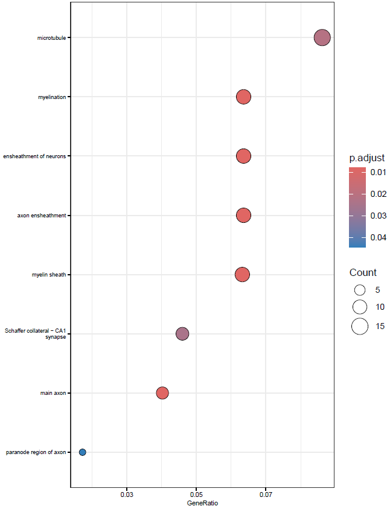
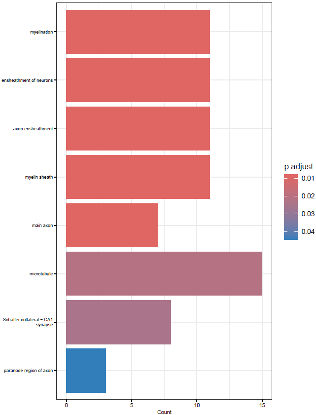
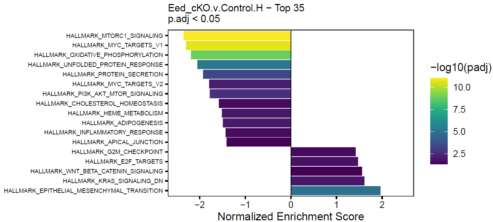
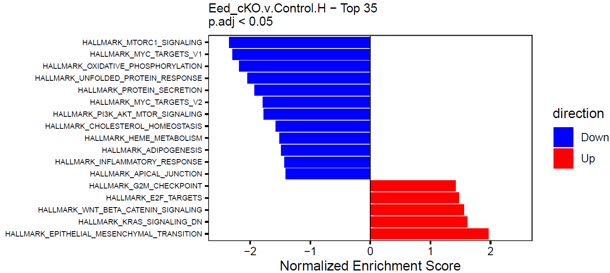

```{r, include=FALSE}
library(BiocStyle)
knitr::opts_chunk$set(echo = TRUE, fig.align = "center", message = FALSE, warning = FALSE)
```

# Introduction

This is an example template for running a typical differential expression analysis using 
[DESeq2](https://bioconductor.org/packages/release/bioc/html/DESeq2.html) via [halfBaked](https://j-andrews7.github.io/halfBaked/).
It is meant to be a starting point for your own analysis and is not a comprehensive guide to all the options available in DESeq2 or halfBaked.

# Load the Pin (or SummarizedExperiment)

This vignette assumes that you have already created a pin with the `halfBaked` package (see `vignette("halfBaked Pin Generation Template")`) that you want to load 
or that you have a `SummarizedExperiment` object that you want to use.

If you already have a `SummarizedExperiment` object, you can skip this step and load it directly.

```{r, message=FALSE}
library(halfBaked)
library(DESeq2)
library(SummarizedExperiment)
library(pins)
library(openxlsx)
library(msigdbr)
library(BiocParallel)
library(rrvgo)

set.seed(7)

board <- board_url(params$board)
se <- pin_read(board, params$pin_name)
```

# Dataset Description

If stored in the `SummarizedExperiment`, we can show the experiment description directly.

```{r, results='asis'}
cat(metadata(se)$description)
```

# Run Differential Expression via DESeq2

See `halfBaked::get_DESEQ2_res()` for more details on the parameters.

```{r, eval = FALSE}
# Design is just being set to no design here (~ 1).
# The function will take care of setting this.
dds <- DESeqDataSet(se, design = ~1)
dds <- DESeq(dds)

# To hold the results for each comparison.
res <- list()

# Whatever can be used as name of contrast vectors.
contrasts <- list(
    "Eed_cKO.v.Control" = c("Group", "Eed_cKO", "Control")
)

res <- get_DESeq2_res(dds,
    res.list = res, contrasts = contrasts,
    add.rowData = c("ENSEMBL", "SYMBOL")
)

# Cram DE results into SE metadata.
se.meta <- metadata(se)
se.meta$DESeq2.Results <- res
metadata(se) <- se.meta

# Save all results to file if wanted.
dir.create("./de", showWarnings = FALSE)
write.xlsx(res, file = "./de/All.Comparisons.DEGs.xlsx", overwrite = TRUE)
```

# Enrichment/Over-representation Analyses

Hypergeometric enrichment analyses are pretty standard after differential expression.
We use the `run_enrichment()` function to make these more convenient to run.
This function largely uses the [clusterProfiler](https://yulab-smu.top/biomedical-knowledge-mining-book/enrichment-overview.html) package.

```{r, eval = FALSE}
# Set species and database stuff for enrichments
if (params$species %in% c("human", "mouse")) {
    if (params$species == "human") {
        orgdb <- "org.Hs.eg.db"
        msig.species <- "Homo sapiens"
    } else {
        orgdb <- "org.Mm.eg.db"
        msig.species <- "Mus musculus"
    }
} else {
    stop("species parameter must be 'human' or 'mouse'")
}

# Edit if you'd like
sig_th <- 0.05
lfc_th <- 0
sig_col <- "padj"
lfc_col <- "log2FoldChange"

kegg_res <- list()
rct_res <- list()
go_res <- list()

for (rez in names(res)) {
    df <- res[[rez]]

    curr_lfc_th <- lfc_th

    # Handle instances where shrunken LFCs are lower than the LFC testing threshold.
    # An annoying quirk of DESeq2 LFC shrinkage, just as stupid as it looks.
    if (grepl("-shLFC0|-LFC0", rez)) {
        curr_lfc_th <- as.numeric(unlist(strsplit(rez, "LFC"))[2])
    }

    bg <- df$ENSEMBL[!is.na(df[[sig_col]])]

    up_genes <- df$ENSEMBL[!is.na(df[[sig_col]]) &
        df[[sig_col]] < sig_th &
        df[[lfc_col]] > curr_lfc_th]

    dn_genes <- df$ENSEMBL[!is.na(df[[sig_col]]) &
        df[[sig_col]] < sig_th &
        df[[lfc_col]] < -curr_lfc_th]

    if (length(up_genes) > 0) {
        kegg_res <- run_enrichment(up_genes, bg,
            res.name = paste0(rez, "_up"),
            res.list = kegg_res, OrgDb = orgdb,
            method = "KEGG", species = params$species
        )

        rct_res <- run_enrichment(up_genes, bg,
            res.name = paste0(rez, "_up"),
            res.list = rct_res, OrgDb = orgdb,
            method = "Reactome", species = params$species
        )

        go_res <- run_enrichment(up_genes, bg,
            res.name = paste0(rez, "_up"),
            res.list = go_res, OrgDb = orgdb,
            method = "GO", species = params$species
        )
    }

    if (length(dn_genes) > 0) {
        kegg_res <- run_enrichment(dn_genes, bg,
            res.name = paste0(rez, "_dn"),
            res.list = kegg_res, OrgDb = orgdb,
            method = "KEGG", species = params$species
        )

        rct_res <- run_enrichment(dn_genes, bg,
            res.name = paste0(rez, "_dn"),
            res.list = rct_res, OrgDb = orgdb,
            method = "Reactome", species = params$species
        )

        go_res <- run_enrichment(dn_genes, bg,
            res.name = paste0(rez, "_dn"),
            res.list = go_res, OrgDb = orgdb,
            method = "GO", species = params$species
        )
    }
}

full_res <- c(kegg_res, rct_res, go_res)
```

## Create Summary Table

Individual files are for the birds.

```{r, eval = FALSE}
dir.create("./enrichments", showWarnings = FALSE)

# Excel sheets can only be 31 characters, so it is necessary to shorten the names
names(full_res) <- gsub("Reactome", "RCT", names(full_res))
names(full_res) <- gsub("Control", "Ctl", names(full_res))
names(full_res) <- gsub("\\.v\\.", "v", names(full_res))

write.xlsx(full_res, file = "./enrichments/allresults.xlsx", overwrite = TRUE)

# Save to SE object.
metadata(se)$DESeq2.enrichments <- full_res
```


## Basic Visualization

A picture's worth 10000 words of AI-generated slop.

```{r, eval = FALSE}
my_theme <- theme(
    axis.text.y = element_text(size = 6, color = "black"),
    axis.text.x = element_text(color = "black"),
    axis.ticks = element_line(color = "black")
)

# Basic bar and dotplots for arbitrary top X enriched gene sets
for (comp in names(full_res)) {
    enr <- full_res[[comp]]
    message(comp)

    pdf(paste0("enrichments/", comp, "_Enrichments.Top30.pdf"),
        width = 6, height = 8
    )
    print(dotplot(enr, showCategory = 30, font.size = 7) + my_theme)
    print(dotplot(enr, size = "Count", showCategory = 30, font.size = 7) + my_theme)
    print(barplot(enr, showCategory = 30, font.size = 7) + my_theme)
    dev.off()

    # This collapses redundant GO terms into a single term based on similarity.
    # The set with the lowest p-value in each cluster is used as the label.
    if (grepl("GO", comp)) {
        enr <- simplify(enr)

        pdf(paste0("enrichments/", comp, "_collapsedEnrichments.Top30.pdf"),
            width = 6, height = 8
        )
        print(dotplot(enr, showCategory = 30, font.size = 7) + my_theme)
        print(dotplot(enr, size = "Count", showCategory = 30, font.size = 7) + my_theme)
        print(barplot(enr, showCategory = 30, font.size = 7) + my_theme)
        dev.off()
    }
}
```

This will create simple dot and barplots like so:

```{r, echo = FALSE, out.width = "40%", out.height = "40%", fig.show = "hold", fig.align = "center"}
# Delete me if using as a template


```

## Clustering GO Terms

GO terms can be very redundant, which makes coming through the results and summarizing them a headache.
One solution to this is to cluster terms with a high degree of overlap and then summarize the cluster.

```{r, eval = FALSE}
onts <- c("BP", "CC", "MF")

up.col <- "#56B4E9"

gobp_res <- grep("GOBP", names(full_res))
gomf_res <- grep("GOMF", names(full_res))
gocc_res <- grep("GOCC", names(full_res))

clustered_res_size <- list()
clustered_res_uniqueness <- list()
clustered_res_log10_padjscore <- list()

for (ont in onts) {
    # Get the GO terms for the current ontology
    if (ont == "BP") {
        curr_go <- gobp_res
    } else if (ont == "CC") {
        curr_go <- gocc_res
    } else {
        curr_go <- gomf_res
    }

    godat <- GOSemSim::godata(orgdb, ont = ont)

    # Ignore these words, alter as wanted
    stoppers <- tm::stopwords(kind = "en")
    stoppers <- c(
        stoppers, "regulation", "positive",
        "negative", "process", "cell", "activity"
    )

    for (i in names(full_res)[curr_go]) {
        enr.up <- full_res[[i]]

        # Collapse similar terms, score by term size, uniqueness, or significance
        if (!is.null(enr.up)) {
            if (nrow(enr.up) > 2) {
                dir.create(file.path("enrichments", "reduced"),
                    recursive = TRUE, showWarnings = FALSE
                )

                enr.up.sim <- calculateSimMatrix(enr.up$ID,
                    orgdb = orgdb,
                    ont = ont,
                    semdata = godat,
                    method = "Rel"
                )

                enr.up.scores <- -log10(enr.up$p.adjust)
                names(enr.up.scores) <- enr.up$ID

                enr.up.red.size <- reduceSimMatrix(enr.up.sim,
                    scores = "size",
                    threshold = 0.7, orgdb = orgdb
                )

                enr.up.red.unique <- reduceSimMatrix(enr.up.sim,
                    scores = "uniqueness",
                    threshold = 0.7, orgdb = orgdb
                )

                enr.up.red.score <- reduceSimMatrix(enr.up.sim,
                    scores = enr.up.scores,
                    threshold = 0.7, orgdb = orgdb
                )
                
                clustered_res_size[[i]] <- enr.up.red.size
                clustered_res_uniqueness[[i]] <- enr.up.red.unique
                clustered_res_log10_padjscore[[i]] <- enr.up.red.score

                write.table(enr.up.red.size,
                    file = file.path(
                        "./enrichments/reduced",
                        paste0(i, ".termsim.Reduced.size.0.7.txt")
                    ),
                    sep = "\t",
                    row.names = FALSE, quote = FALSE
                )

                write.table(enr.up.red.unique,
                    file = file.path(
                        "./enrichments/reduced",
                        paste0(i, ".termsim.Reduced.uniqueness.0.7.txt")
                    ),
                    sep = "\t",
                    row.names = FALSE, quote = FALSE
                )

                write.table(enr.up.red.score,
                    file = file.path(
                        "./enrichments/reduced",
                        paste0(i, ".termsim.Reduced.log10_padjscore.0.7.txt")
                    ),
                    sep = "\t",
                    row.names = FALSE, quote = FALSE
                )

                pdf(
                    file.path(
                        "./enrichments/reduced",
                        paste0(i, ".barplot.termsim.Reduced.size.0.7.pdf")
                    ),
                    width = 5, height = 6
                )
                p <- plot_clustered_terms_top(enr.up.red.size,
                    color = up.col,
                    n.top.terms = 5, xlabel = "term size", stoppers = stoppers
                )
                print(p)

                p <- plot_clustered_terms_top(enr.up.red.size,
                    color = up.col,
                    n.top.terms = 5, n.top.clusters = 20,
                    xlabel = "term size", stoppers = stoppers
                ) +
                    ggtitle("top 20 clusters by score")
                print(p)
                dev.off()

                pdf(
                    file.path(
                        "./enrichments/reduced",
                        paste0(i, ".barplot.termsim.Reduced.uniqueness.0.7.pdf")
                    ),
                    width = 5, height = 6
                )
                p <- plot_clustered_terms_top(enr.up.red.unique,
                    color = up.col,
                    n.top.terms = 5, xlabel = "uniqueness", stoppers = stoppers
                )
                print(p)

                p <- plot_clustered_terms_top(enr.up.red.unique,
                    color = up.col,
                    n.top.terms = 5, n.top.clusters = 20,
                    xlabel = "uniqueness", stoppers = stoppers
                ) +
                    ggtitle("top 20 clusters by score")
                print(p)
                dev.off()

                pdf(
                    file.path(
                        "./enrichments/reduced",
                        paste0(i, ".barplot.termsim.Reduced.log10padj_scores.0.7.pdf")
                    ),
                    width = 5, height = 6
                )
                p <- plot_clustered_terms_top(enr.up.red.score,
                    color = up.col,
                    n.top.terms = 5, xlabel = "-log10(adj.pval)", stoppers = stoppers
                )
                print(p)

                p <- plot_clustered_terms_top(enr.up.red.score,
                    color = up.col,
                    n.top.terms = 5, n.top.clusters = 20,
                    xlabel = "-log10(adj.pval)", stoppers = stoppers
                ) +
                    ggtitle("top 20 clusters by score")
                print(p)
                dev.off()
            }
        }
    }
}

# Again, tack onto SE
metadata(se)$DESeq2.clustered_GO_enrichment <- list(
    size = clustered_res_size,
    uniqueness = clustered_res_uniqueness,
    log10_padjscore = clustered_res_log10_padjscore
)
```

This will spit out barplots with the most frequent terms for each cluster as labels and the largest term size, uniqueness, or highest -log10(p-value) of a term as the representative score of the cluster.

The p-value scoring likely makes the most sense.

These plots are good for condensing many GO terms into clusters that can be meaningfully interpreted in a broad sense.

```{r, echo = FALSE, eval = FALSE, out.width = "80%", fig.align = "center"}
# Delete me if using as a template
knitr::include_graphics("./images/GO_cluster_barplot_example.png")
```


# GSEA

Gene set enrichment analysis (GSEA) is another pretty typical follow-up to differential expression analyses.

## Load Gene Sets

Our gene sets just need to be in a named list, where the name of each element corresponds to the gene set identifier and the element itself is just a vector of gene identifiers.

The [MSigDB](https://www.gsea-msigdb.org/gsea/msigdb/) database is a very popular source of gene sets, as it contains numerous collections.
We can use the `msigdbr` package for simple access to these gene sets.

In this case, we show how to create a nested list of lists, where the first level is the gene set collection/subcollection, and the
second level are the named vectors with the actual gene set name and members.

```{r, eval = FALSE}
# Set categories and subcategories that we want to retrieve, see msigdbr_collections()
# These vectors must be of equal length.
cats <- c("H", "C2", "C2", "C2", "C3", "C5", "C5", "C5", "C5", "C8")
subcats <- c(
    "", "CGP", "CP:KEGG", "CP:REACTOME", "TFT:GTRD",
    "GO:MF", "GO:BP", "GO:CC", "HPO", ""
)

msig_lists <- list()

# Get gene sets for each category and subcategory and stick in the msig.lists
for (i in seq_along(cats)) {
    cat <- cats[i]
    subcat <- subcats[i]

    msig <- msigdbr(species = msig.species, category = cat, subcategory = subcat)

    # Split into a named list
    msig_ls <- msig %>% split(x = .$gene_symbol, f = .$gs_name)

    # Stick in the list
    if (subcat == "") {
        outname <- cat
    } else {
        outname <- paste0(cat, "_", subcat)
    }

    msig_lists[[outname]] <- msig_ls
}

# We could also use custom gene sets, perhaps stored in a pin
# Potentially as nested lists for easier selection.
# board <- board_connect(server = params$board)
# gs <- pin_read(board, gs.pin)
```

## Create Ranked Gene Lists

GSEA requires a ranked list of genes, so we will use the test statistic, as it is signed and correlates with both significance and effect size. 
Some people use shrunken log2 fold changes for DESeq2 result, but the test statistic feels more flexible.

```{r, eval = FALSE}
# Add as many comparisons as wanted here.
# Should match values in `names(dds.meta$DE.Results)`.
dges <- c("Eed_cKO.v.Control")

ranked_lists <- list()

for (d in dges) {
    out.res <- dds.meta$DESeq2.Results[[d]]
    gsea.df <- out.res[!(is.na(out.res$padj)), ]

    gsea.df.gsea <- gsea.df$stat
    names(gsea.df.gsea) <- make.names(gsea.df$SYMBOL, unique = TRUE)

    ranked_lists[[d]] <- gsea.df.gsea
}
```

## Run GSEA

Now we're ready to perform GSEA for each of the ranked gene sets.

We'll also loop through the gene collections to run on each individually.

See `run_GSEA()` for full parameters.

```{r, eval = FALSE}
res_list <- list()

for (i in seq_along(ranked_lists)) {
    ranked_genes <- ranked_lists[[i]]
    ranked_name <- names(ranked_lists)[i]
    message(paste0("Running pre-ranked GSEA for: ", ranked_name))

    # Loop through the gene collections
    for (j in seq_along(msig_lists)) {
        msig_ls <- msig_lists[[j]]
        msig_name <- names(msig_lists)[j]

        # Remove the colon or it'll break file paths
        msig_name <- gsub(":", "_", msig_name)

        message(paste0("Using collection: ", msig_name))

        # Run GSEA
        res_list <- run_GSEA(msig_ls, ranked_genes,
            outdir = "./GSEA/", res.name = paste0(ranked_name, ".", msig_name),
            res.list = res_list
        )
    }
}

# Excel sheets can only be 31 chars, so it is often necessary to shorten the names
names(res_list) <- gsub("REACTOME", "RCT", names(res_list))

# Add to metadata of the SummarizedExperiment object
metadata(se)$DESeq2.GSEA <- res_list
```

## Create Summary Table

The `run_GSEA` function generates a ton of output depending on how many ranked lists are used.
Ultimately, it's pretty nice to have that all in a single file for easy sharing/perusal, so we'll write each results table to a worksheet of an excel file.

```{r, eval = FALSE}
write.xlsx(res_list, file = "./GSEA/MSigDB.allresults.xlsx", overwrite = TRUE)
saveRDS(res_list, file = "./GSEA/MSigDB.allresults.RDS")
```

## Create Summary Figures

GSEA returns a lot of output and can be hard to summarize, so this is an attempt to make the results more compact by chucking the top X significant gene sets into a single figure.

We can do this for each element in our GSEA results list.
See `GSEA_barplot()` for full parameters.

```{r, eval = FALSE}
for (res in names(res_list)) {
    message(paste0("Plotting GSEA results for: ", res))

    p <- GSEA_barplot(
        gsea.res = res_list[[res]], genesets.name = res,
        padj.th = 0.05, top = 35
    )

    # Can also color by direction rather than adj. p
    p2 <- GSEA_barplot(
        gsea.res = res_list[[res]], genesets.name = res,
        padj.th = 0.05, top = 35, color.by.direction = TRUE
    )

    # Dynamic height adjustment
    h <- 2 + (0.07 * nrow(p$data))

    pdf(paste0("./GSEA/", res, ".GSEA_barplot.pdf"), height = h, width = 7)
    print(p)
    print(p2)
    dev.off()
}
```

This will create simple barplots like so:

```{r, echo = FALSE, eval = TRUE, out.width = "70%", fig.align = "center"}
# Delete me if using as a template


```

# Write Pin

The `pin` can now be saved with the new DE, enrichment, and GSEA data included.

```{r, eval = FALSE}
# Write the pin with the new data
board <- board_connect(server = params$board)
pin_write(board, se,
    type = "rds", name = params$pin_name, title = params$pin_name,
    description = params$pin_description
)

# Can save the object locally if wanted as well.
saveRDS(se, file = paste0("./", params$pin_name, ".RDS"))
```

# SessionInfo

<details>

<summary>Click to expand</summary>

```{r, echo = FALSE}
sessionInfo()
```

</details>
